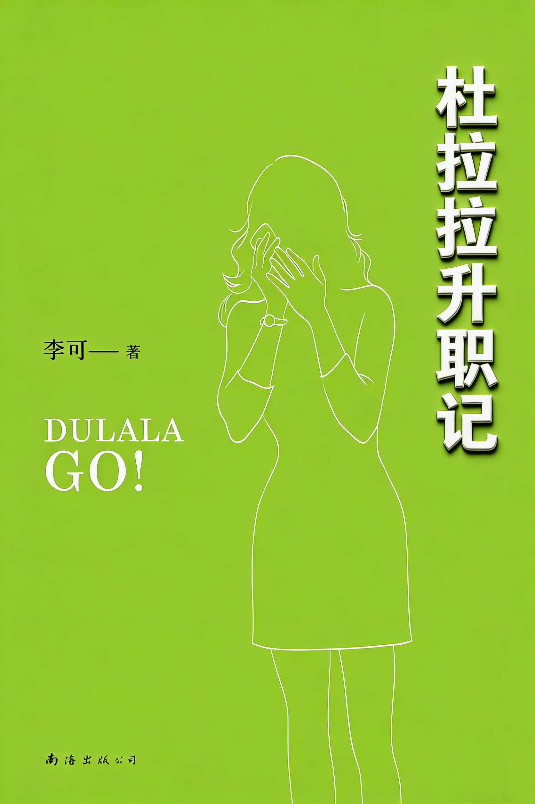
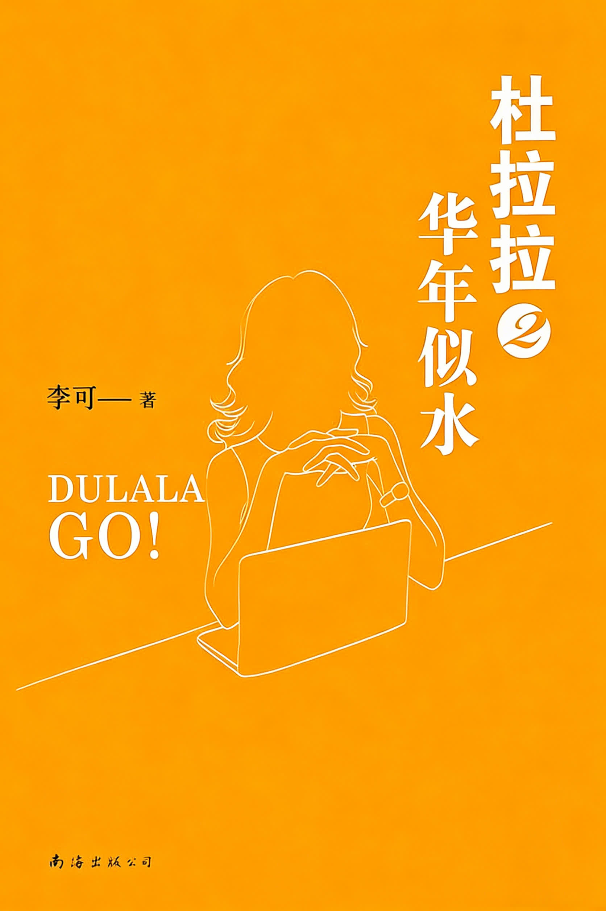
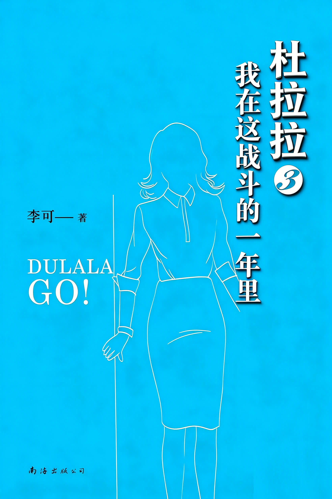
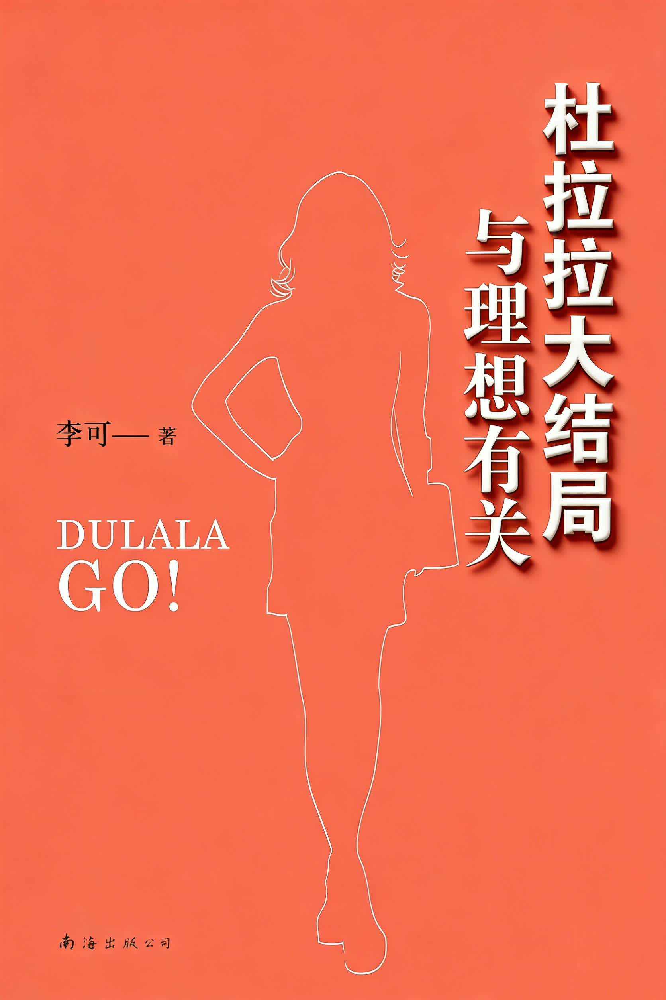

# 杜拉拉系列

## 杜拉拉升职记

- [PDF](1.pdf)
- [HTML 文本](1.html)
- [HTML 文本 dulala.netlify.app](https://dulala.netlify.app/1.html)

杜拉拉从国企、民企辗转进入外企 DB，在行政与人事岗位上应对上司、同事和项目压力。小说写她从职场新人到管理者的成长，也穿插爱情选择与职业定位。

## 杜拉拉2 华年似水

- [PDF](2.pdf)
- [HTML 文本](2.html)
- [HTML 文本 dulala.netlify.app](https://dulala.netlify.app/2.html)

拉拉遭遇离职、感情失落和职业瓶颈，在房价、晋升、组织改革与人际关系的夹击下重新判断定位。故事关注时机、选择和职场筹码，写她如何寻找翻盘机会。

## 杜拉拉3 我在这战斗的一年里

- [PDF](3.pdf)
- [HTML 文本](3.html)
- [HTML 文本 dulala.netlify.app](https://dulala.netlify.app/3.html)

拉拉离开工作多年的 DB，进入五百强企业 SH 担任薪酬福利经理。新环境带来扩张期的人事斗争、专业挑战和感情重聚后的复杂关系，她开始新一轮职场博弈。

## 杜拉拉大结局 与理想有关

- [PDF](4.pdf)
- [HTML 文本](4.html)
- [HTML 文本 dulala.netlify.app](https://dulala.netlify.app/4.html)

拉拉在 SH 面对薪酬制度难题，努力推进宽带薪酬制，同时受到创业诱惑和婚后变故冲击。结局聚焦她从青涩到练达的成长，以及对理想与行动的坚持。
